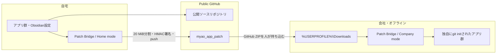
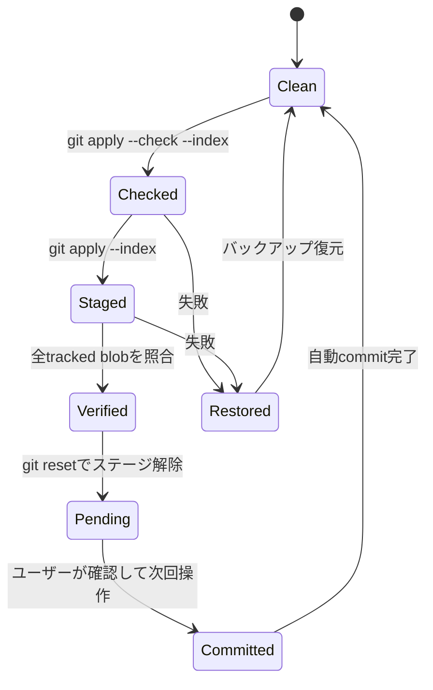

# 全体設計

## 目的

自宅で開発している公開Gitリポジトリの変更を、GitHubへ接続できず、独自に `git init` された会社側リポジトリへ安全に適用します。自宅と会社のコミットID・コミット履歴が一致しないため、履歴の移送ではなく、Git blobとファイル差分を使用します。

## システム構成



Patch App本体のリポジトリと生成パッチ専用リポジトリは分離します。

```text
myao-patch-bridge      Patch App本体
myao_app_patch         生成パッチ専用
```

## 自宅側の状態

各リポジトリについて以下をローカル設定に保存します。

- 安定したリポジトリID
- 固定ブランチ
- 会社へ最初に導入済みのソースコミット
- 最後にパッチリポジトリへpushしたソースコミット
- 有効・無効

pushが成功した時点で、自宅側では会社へ適用済みとして扱います。実際の適用実績を会社から持ち帰る処理はありません。

## 会社側の状態

会社側ではリポジトリごとに次のファイルを作ります。

```text
.git/rep-patch/state.json
```

Git管理対象外なので、手動コミットやPatch App更新の影響を受けません。以下を保持します。

- 最後にコミット済みのパッチ連番
- 現在未コミットで運用確認中の連番
- 適用後に期待されるGit blob一覧
- 適用対象パス
- 適用前バックアップ

## 適用トランザクション



全アプリ適用はリポジトリ単位の独立トランザクションです。1つが失敗しても、そのアプリだけ復元し、他のアプリは続行します。

## React PWA

- Reactのビルド成果物をPython APIと同梱
- `127.0.0.1:17345` の固定オリジン
- Edgeからインストール可能
- Service Workerは静的UIだけをキャッシュ
- API、パス、ZIP、ログはキャッシュしない
- PWAを開く前にPythonバックエンドを起動する必要がある
